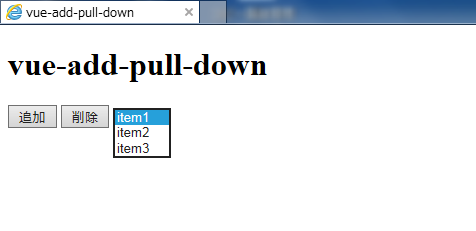

# vue-add-pull-down
sample code for 'Add Pull-down' with [vue.js](https://jp.vuejs.org/)

[vue.js](https://jp.vuejs.org/)を用いてプルダウン(select要素)を動的に追加するサンプルを作成しました。

## Screenshot

## License

MIT License
